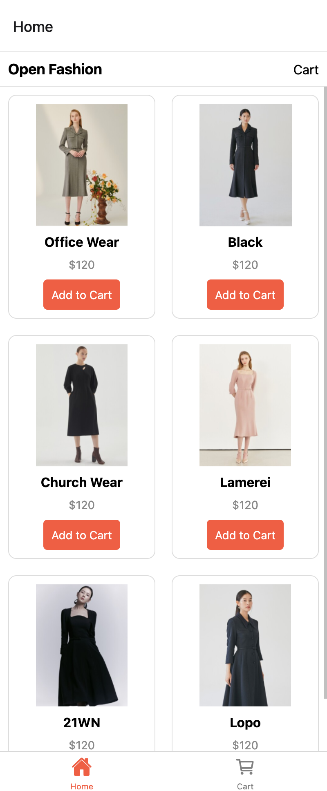
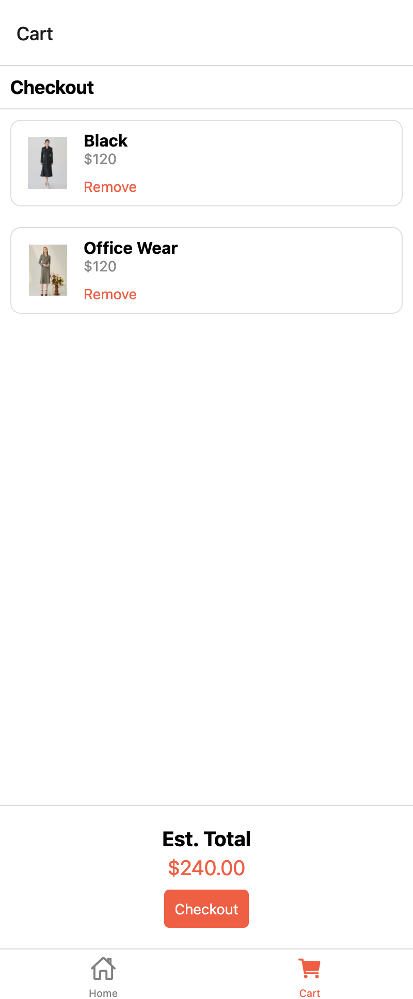

# README

## Design Choices

For this assignment, I chose to use React Navigation to handle the navigation between the HomeScreen and CartScreen. I used a bottom tab navigator to switch between the two screens. I also used AsyncStorage to store the cart items locally on the device.

## Implementation

### HomeScreen

The HomeScreen displays a list of available products. Each product has an "Add to Cart" button. When the button is pressed, the product is added to the cart and stored in AsyncStorage.

### CartScreen

The CartScreen displays the items in the cart. Each item has a "Remove" button. When the button is pressed, the item is removed from the cart, and the updated cart is stored in AsyncStorage.

### Screenshots

  

  

## Code Organization

The code is organized into three main files:

- `App.js`: Handles navigation between HomeScreen and CartScreen.
- `HomeScreen.js`: Displays the list of products and handles "Add to Cart" functionality.
- `CartScreen.js`: Displays cart items and handles "Remove" functionality.

## Local Storage

I used AsyncStorage to store cart items locally on the device:

- When an item is added to the cart, it's stored in AsyncStorage.
- When CartScreen loads, cart items are retrieved from AsyncStorage and displayed.
- When an item is removed from the cart, it's deleted from AsyncStorage.

